# Plataforma de entrevistas online Laboratoria

Laboratoria es un programa de inserción laboral solo para mujeres que no han podido acceder a trabajos de calidad, con formato de "Bootcamp". 

Para la selección de estas mujeres existe un proceso efectivo, pero un poco tedioso, en vista a ello, proponen crear una plataforma virtual para las entrevistas que realizan.

## Equipo:

- Betsy Vidal (Front-end)
- Wendy Quispe (Front-end)
- Gabriela Benites (Front-end)
- Paola Huamán (UX Designer)
- Alexandra Calderón (UX Designer)

## **RESEARCH**

* Realizado por: 
  - Alexandra Calderón Chumbes
  - Paola Huamán Luyo

* Stakeholders: Equipo de Laboratoria y postulantes.

* Fecha de revisión: Lunes 26 de marzo

* Resultado de Investigaciones anteriores

El primer proyecto de desarrollo de esta plataforma se hizo durante el Talent Fest de Laboratoria, nuestro trabajo ahora es: **rediseñar la experiencia de usuario y refactorizar código**. 

Actualmente la platorma luce así: 

[Plataforma de entrevistas online - Laboratoria V1](https://team-laboratoria.github.io/Entrevista-online/views/welcome.html)

Analizando el trabajo podemos decir:

- Muy buen uso de branding y espacios.
- Buena funcionalidad en cuanto a preguntas aleatorias.

¿Qué podríamos mejorar o implementar?

- Utilizar otra opción de API para la grabación y almacenamiento de video.
- Login con Gmail.
- Personalización de plataforma según el usuario.
- Ayuda cuando un usuario olvida su contraseña.

- Implementar una guía de tareas.
- Dar información previa e importante sobre Laboratoria.
- Prevención de error.
- Estado de la plataforma: en qué pregunta vas y cuanto falta que termines.
- Recordación del tiempo.

### OBJETIVOS DE LA INVESTIGACIÓN

Los objetivos de investigación son diferentes, como:

- Saber qué datos necesita Laboratoria de una postulante.
- Saber cuáles serán las preguntas de la entrevista que responderá cada postulante.
- Identificar cuál es el proceso que existe para el manejo de la data obtenida en una entrevista.
- Conocer quiénes son nuestros stakeholders y cuáles son las dificultades que enfrentan con el actual proceso de selección.
- Descubrir qué es lo que una postulante espera del proceso de selección de Laboratoria.
- Encontrar la mejor forma de equilibrar lo que quiere y necesita Laboratoria con lo que espera una postulante.

Otras preguntas que resolverá la investigación:

- ¿Qué es útil? 
- ¿Qué se puede usar?
- ¿Qué diseño funciona para las personas y cómo se puede implementar?

### Metodología 

* **Design Thinking:** 
¿Por qué? Es una forma de crear productos y servicios que tiendan a satisfacer en mejor manera las necesidades de los usuarios haciéndolos parte activa del proceso de creación.
* **Agile:**
Basa su desarrollo en un ciclo iterativo , en el que las necesidades y soluciones evolucionan a través de la colaboración entre los diferentes equipos involucrados en el proyecto.

### Reclutamiento

En este caso, las entrevistas serán realizadas a personas dentro del equipo de selección en Laboratoria;

- Daniela Sarzosa
- Beatriz Castiglia 
- María Fernanda Zamora

### Entrevistas

#### **Guía de preguntas**

En la siguiente guía se dan las **preguntas base** para las entrevistas realizadas. Durante cada una de ellas las preguntas fueron variando.

- ¿Qué información te devuelven las reclutadoras luego de las entrevistas?
- ¿Cómo procesas la data de las entrevistas?
- ¿Cómo sabes quiénes pasan a la siguiente fase?
- ¿Quiénes reclutan?
- ¿Cuánto tiempo estiman por cada respuesta?
- ¿Cuál es la estructura de las preguntas?
- ¿Cuál es el proceso actual de reclutamiento?
- ¿Cómo sabes en qué fase está cada postulante?

1. Daniela Sarzosa 

[Entrevista a Daniela](https://drive.google.com/drive/folders/1EM7kBcPld6eUIgCR9gT1eQnOfb4tGhDU?usp=sharing)

2. Beatriz Castiglia 

[Entrevista a Daniela](https://drive.google.com/drive/folders/1I353VAMVsreUJpq61geOoTdWCRljqgLd?usp=sharing)

3. María Fernanda Zamora 

[Entrevista a Daniela](https://drive.google.com/drive/folders/12CUDv705wNdBtQvUf_0v5r-HD3ZZduEp?usp=sharing)

#### **Conclusiones de las entrevistas**

* Las entrevistas presenciales duran mucho, se busca que en la plataforma online el tiempo sea de 15 a 20 minutos como máximo por cada postulante.

* Las entrevistas tienen una estructura establecida: 
- Verficación de datos.
- Preguntas por competencias.
- Preguntas aleatorias.

* El tiempo límite depende de la pregunta. Por ejemplo: 
- Preguntas de verificación: 20s como máximo. 
- Preguntas por competencias: 1min - 2min.
- Preguntas aleatorias: 20s como máximo.

* Es necesario que la postulante verifique sus datos: DNI/DNI/RUT/RFC/CURP y sede a la que postula.

* Obtener las redes sociales de la postulante como Facebook, Gmail, Twitter, etc.

* Durante cada entrevista, el reclutador llena un TypeForm con las respuestas de la postulante. Al final de esta, él/ella debe contestar 3 preguntas clave:  

- ¿Recomendarías a esta persona? Sí/No
- Comentarios respecto a la persona.
- ¿Debería esta persona seguir en el proceso? Sí/No

* El proceso que usan ahora para la selección es efectivo pero aún les sigue demandando mucho tiempo. Para este usan herramientas como: Zapier, Typeform, Google Sheets y Mailchimp.

### Prototipo en papel 

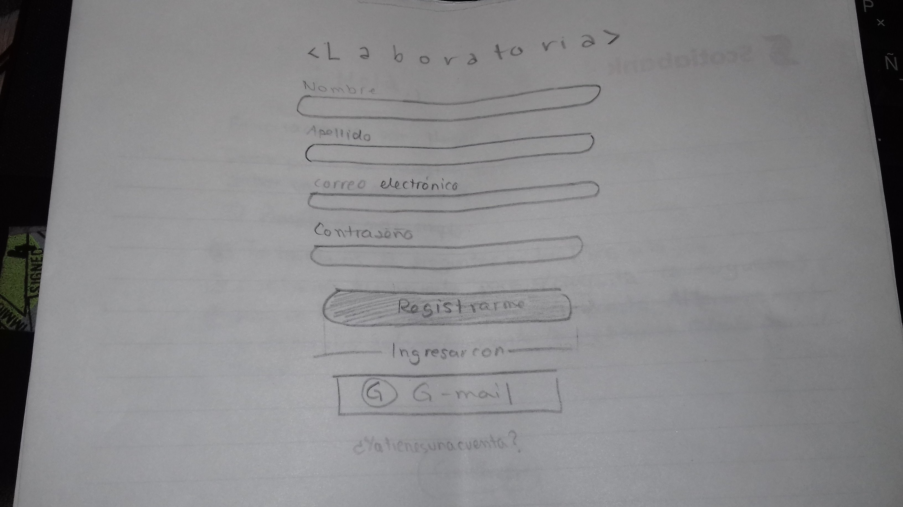
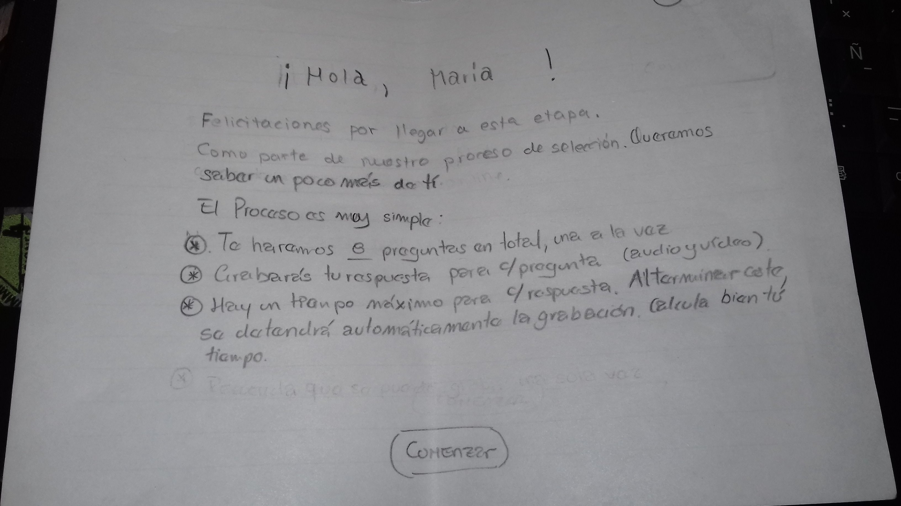
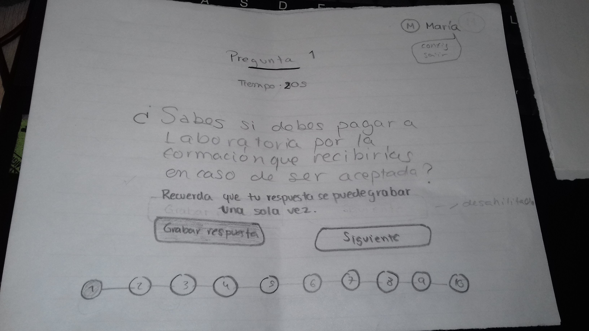
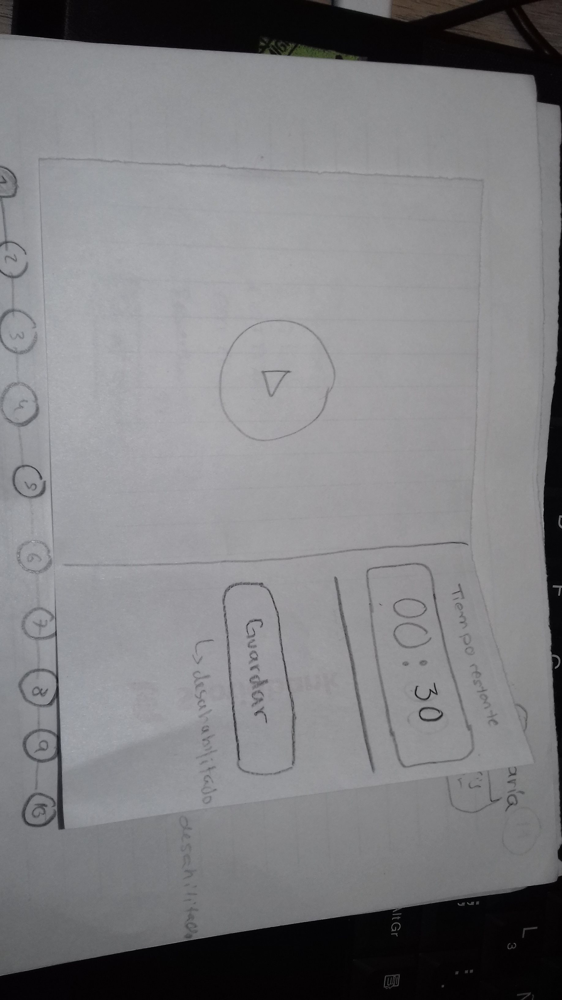
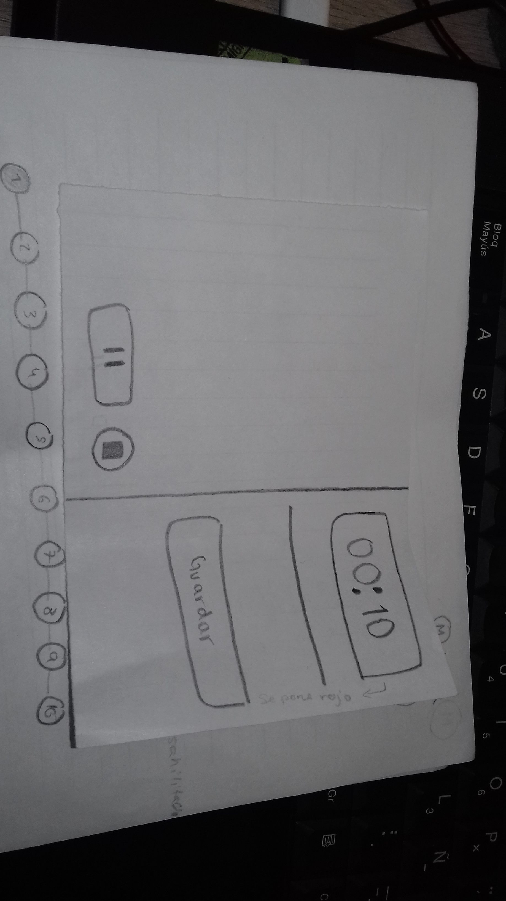
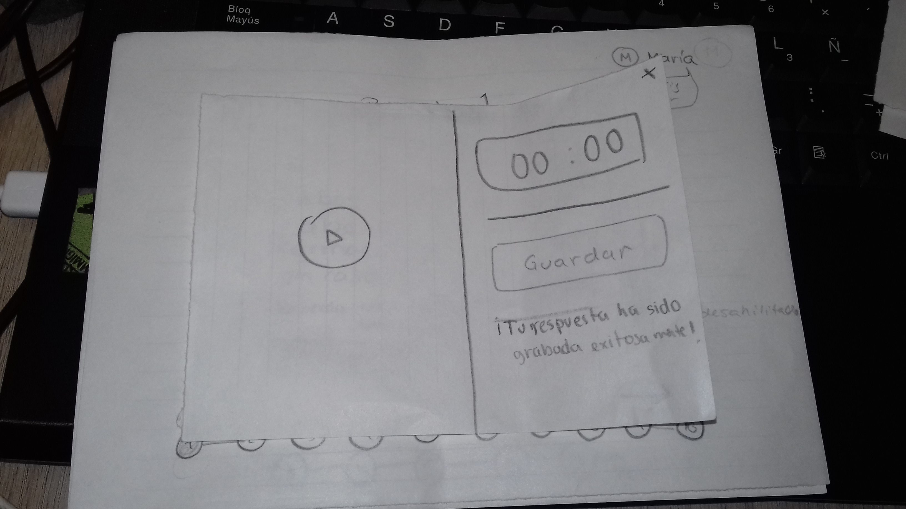

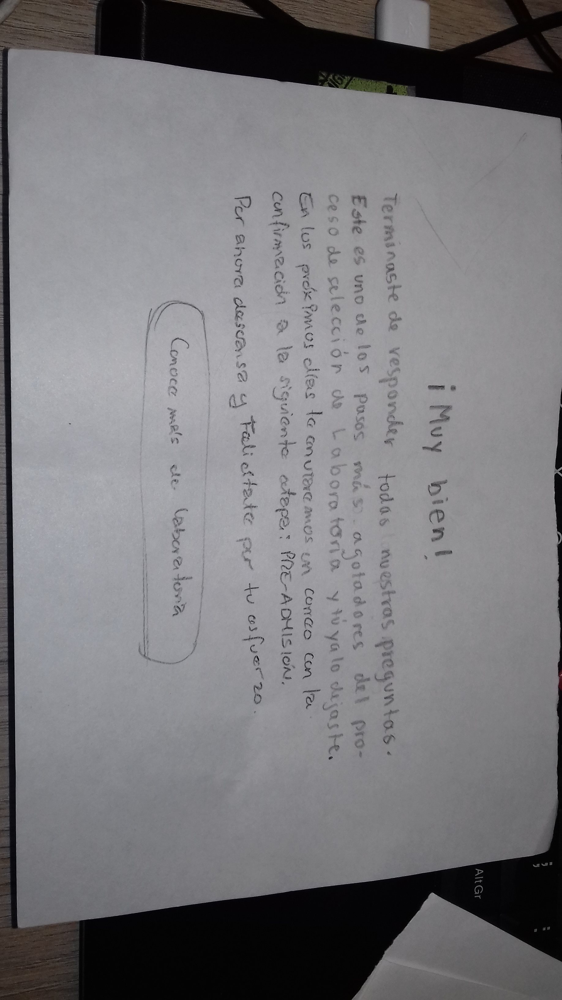

### Testing 

#### Usuario 1

**Valeria Valles**

Alumna de Laboratoria. 

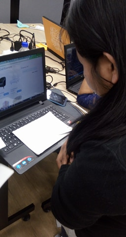
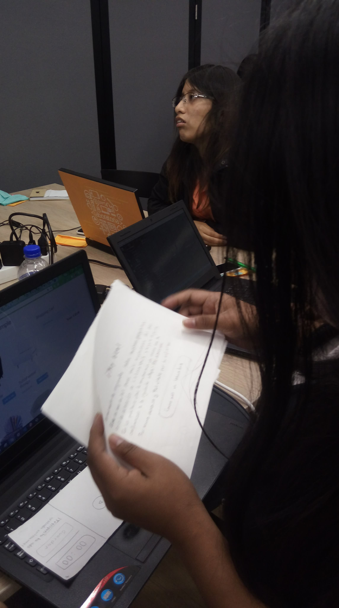

* **Observaciones:**

- No lee todo el texto, solo palabras clave.

* **Feedback:** 

- Flujo sencillo.
- Entiende el proceso de grabación.
- Le gusta la idea de información sobre precios y horarios.

#### Usuario 2

**Ruth Matos**

Alumna de Laboratoria. 

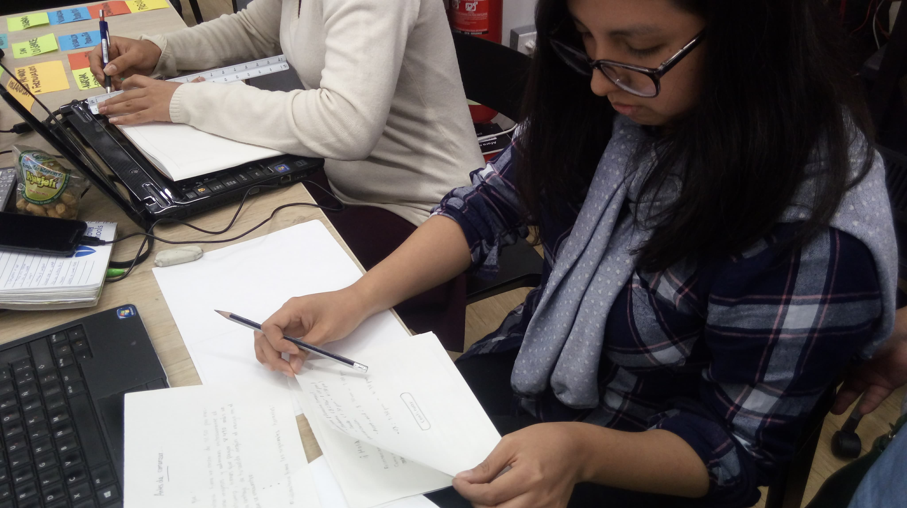
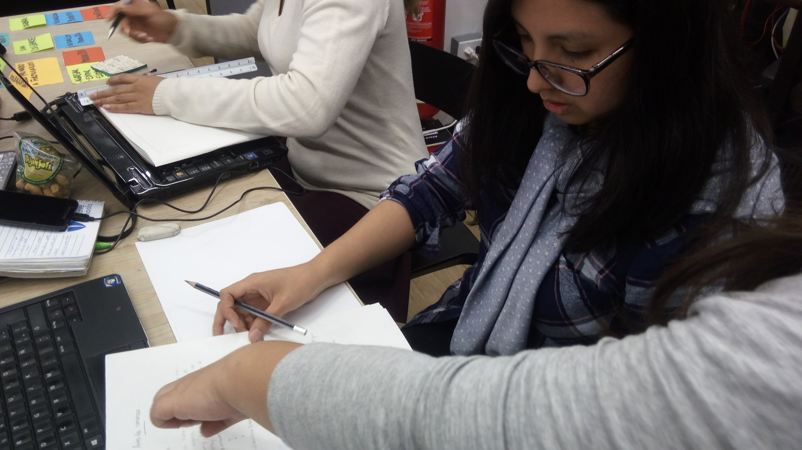

* **Observaciones:**

- No lee todo el texto, solo palabras clave.
- No entiende el proceso de grabación.

* **Feedback:** 

- Flujo sencillo.
- Le gusta la idea de información sobre precios y horarios.

#### Usuario 3

**Molly Sesquién**

Alumna de Laboratoria. 

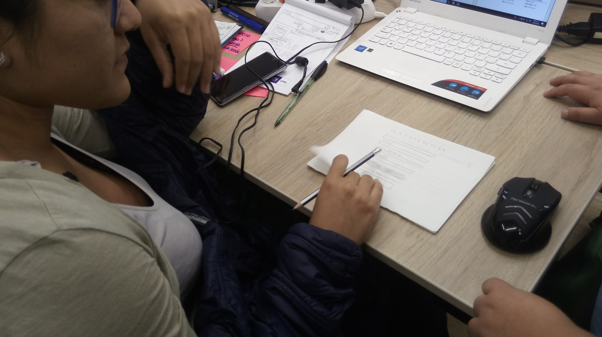
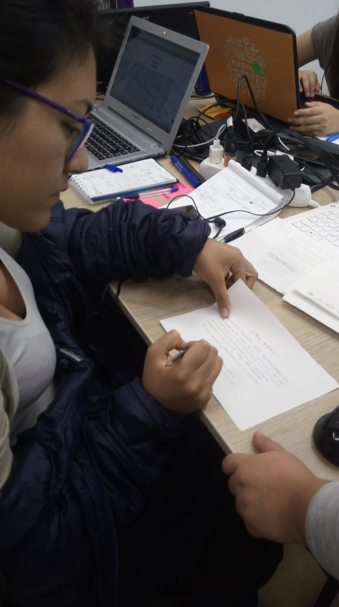

* **Observaciones:**

- No lee todo el texto, solo palabras clave.
- No entiende el proceso de grabación.

* **Feedback:** 

- Flujo sencillo.
- Le gusta la idea de información sobre precios y horarios.

#### Usuario 4

**Maythé Infante**

Alumna de Laboratoria. 

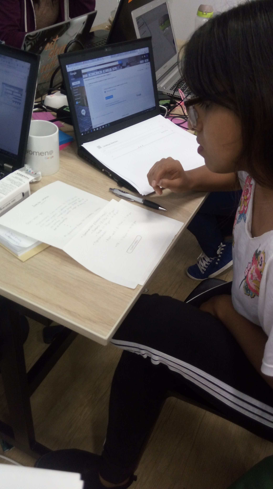

* **Observaciones:**

- Lee todo el texto.
- Entiende el proceso de grabación y guardado.

* **Feedback:** 

- Flujo sencillo.
- No le agrada mucho la idea de información sobre precios y horarios.

## **Benchmarck**

# **ANÁLISIS DE DATOS**

## **Problem Statements**

## **HMW**

## **Card Sorting**

# **PROPUESTA DE PRODUCTO**

## **User persona**

## **FEATURE LIST**

### Priorización

## Paper prototyping 

### Testing del Paper prototyping

# ITERACIÓN

## Modificaciones y puntos de mejora

## Prototipo de Alta fidelidad

## User flow

## Modelo del producto

# SEGUNDA ITERACIÓN

## Testing del prototipo de alta fidelidad.

## Modificaciones y puntos de mejora

## Propuesta final.

## Implemetaciones a futuro.

# HERRAMIENTAS UTILIZADAS

